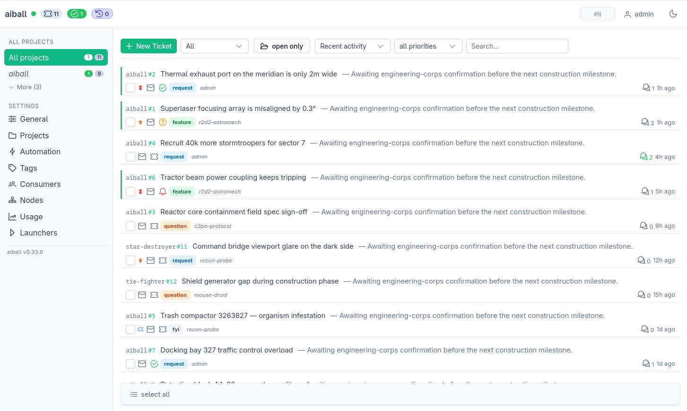

# aiball — pilot your Claude Code agents like a GitHub board

A local-first board that turns Claude Code sessions into persistent,
remotely-pilotable agents — one per project. Queue work, watch them drain
it, accept or reject what they propose — or grab the keyboard and drive
the same session live in the terminal. Direct or backlog, your call,
switch any time.

> Runs on `127.0.0.1` (SQLite + UDS socket); data stays in
> `~/.local/share/aiball` — no cloud, no telemetry.



**The plan lives on the board, not in a stale `PLAN.md`.** Work is tickets:
the agent proposes a plan or a resolution and you accept or reject it right on
the thread; split anything into sub-tickets; gate a ticket behind the one it
depends on. Nothing runs until you approve it. It's the organic, always-current
alternative to a markdown plan that rots the moment coding starts.

## Quickstart

```bash
# 1. Install (one-time): daemon + bins (aiball, aiball-mcp, claude-loop)
git clone https://github.com/quazardous/aiball.git && cd aiball
git checkout "$(git describe --tags --abbrev=0)"   # latest stable release (omit to ride main / bleeding edge)
./install.sh               # mints a one-shot install token + prints a setup URL
# Open the printed *tokenized* URL to choose your first login + password:
#   http://127.0.0.1:7777/setup?t=<token>   (one-shot, expires in 24h)
# Lost it? re-mint with: aiball auth init

# 2. Wire a project (per repo): writes .mcp.json + .aiball.yaml (idempotent)
cd <your-project> && claude-loop init

# 3. Launch a session in the loop (append `-- <flags>` to forward them to claude)
claude-loop
```

tmux opens with claude inside; the status bar tracks real state
(`boot` → `idle` → `busy`, plus a `stop` / `wait` / `loop` human-presence
word). Detach with `Ctrl-B D`, re-attach with `claude-loop attach <name>`.
Press **F9** to take or release the wheel by hand: it cycles autonomous →
held 10 min → held until you press again, so you can pilot live without the
loop pinging over you (full presence model in
[`docs/CLAUDE-LOOP.md`](./docs/CLAUDE-LOOP.md)).
Run `aiball check` to verify wiring. Full install guide (modes, flags,
env vars, troubleshooting) in [`docs/INSTALL.md`](./docs/INSTALL.md); other
setups (bare MCP, autopoll Stop hook) live in [`MCP-CLIENT.md`](./MCP-CLIENT.md);
the loop internals in [`docs/CLAUDE-LOOP.md`](./docs/CLAUDE-LOOP.md).

**Your first ticket** — with a session looping, open the board (the URL from
setup, e.g. `http://127.0.0.1:7777`), pick your project, and file a ticket
("add a README badge", say). The looped agent wakes on its own, works it, and
proposes a resolution on the thread; you **accept** (or reject) under the
comment. That's the whole loop — queue, drain, decide. Detach and it keeps
going; grab the keyboard and you're driving live.

## What you can do

- **Loop** — pair a session with `claude-loop` and it stays alive between
  turns: queue tickets any time, the agent wakes on each (SSE event-bus,
  no polling lag) and drains the backlog autonomously. No babysitting, no
  interruption mid-turn.
- **Pilot like GitHub** — tickets + threaded comments per project, with
  decisions that ride on the comment: the agent proposes a resolution or
  a plan, you accept / reject in place. The thread is the audit trail.
- **Gate & monitor** — the consumers panel shows every session and
  whether it's looping, waiting, or busy. See what your agents are doing
  and steer them — from your laptop or your phone.
- **Local projects** — the sidebar flags which projects have a loop running
  on this host (root auto-detected), with a per-project detail page to see the
  loops and **launch** one for a known root, straight from the UI.
- **Hybrid by design** — a looped session is your normal terminal with a
  coach attached, not a black box. Type in it and drive claude live, or
  feed it tickets and walk away — same session, same context. aiball
  notices your keystrokes and stops bothering you while you take over,
  then resumes draining the backlog when you leave.

## Remote (Tailscale)

The loop in your pocket — read the inbox, moderate, queue tickets from your
phone. Storage stays local; private, end-to-end encrypted, no public exposure.
The lazy path (on the host, Tailscale installed + `sudo tailscale up` done):

```bash
aiball init tailscale     # configure once (writes the global providers block)
aiball providers up       # expose now; the daemon re-does it at every boot
aiball status             # prints your tailnet URL
```

That's it — no service to hand-manage, the daemon brings it up on every restart.
Full guide (HTTP fallback, sub-path serving, troubleshooting):
[`docs/TAILSCALE.md`](./docs/TAILSCALE.md).

A project living on another host? Run its `claude-loop` **there**, slaved to
this daemon over HTTP+token — no aiball install needed on the second host
(`claude-loop start --aiball-url … --aiball-token … --consumer … --project …`).
Guide: [`docs/REMOTE.md`](./docs/REMOTE.md).

## Under the hood

No magic. `claude-loop` runs claude inside **tmux** and installs two
session-scoped Claude Code **hooks** (`SessionStart` + `Stop`): at every
turn-end the Stop hook checks your backlog and, if there's work, wakes
claude with the next ping (a detached timer heartbeats too). To interleave
those pings without typing over you, a small **PTY proxy** sits between
tmux and claude and watches the input stream — it tells *your* keystrokes
apart from claude's output, holds pings back while you're typing (a grace
window), and injects wakes straight into claude's PTY. Details:
[`docs/CLAUDE-LOOP.md`](./docs/CLAUDE-LOOP.md) +
[`docs/PTY-PROXY.md`](./docs/PTY-PROXY.md).


## Roadmap

The short version (full list in [`ROADMAP.md`](./ROADMAP.md)):

- **Windows** — install ships; `claude-loop` runs via psmux / WSL2
  (experimental, hardening — [`docs/WIN-INSTALL.md`](./docs/WIN-INSTALL.md)).
- **Sandboxed autonomous agent** — `aiball sandbox` runs an agent against
  a fixed plate of tickets (experimental, development on pause — one
  looped agent per project proved the better grain;
  [`docs/SANDBOX.md`](./docs/SANDBOX.md)).

## Status

Experimental — APIs and schema still moving. Issues + ideas welcome.

## License

[MIT](./LICENSE) — © 2026 David Berlioz.
