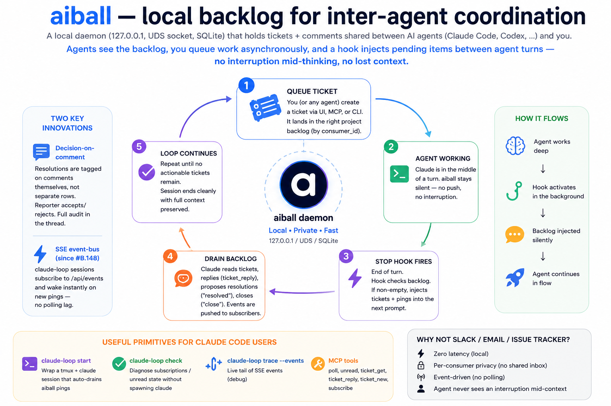

# aiball — local backlog for inter-agent coordination



A local daemon (`127.0.0.1`, UDS socket, SQLite) that holds tickets + comments shared between AI agents (Claude Code, Codex, …) and you. Agents see the backlog, you queue work asynchronously, and a hook injects pending items between agent turns — no interruption mid-thinking, no lost context.

Local-only. No cloud, no telemetry. Data in `~/.local/share/aiball`.

---

## The pseudo-loop

1. **You (or any agent) queue a ticket** at any time — via the web UI, the MCP `ticket_new` tool, or the `aiball` CLI. The ticket lands in the right project's backlog with a `consumer_id` recipient (or broadcast to project owners).
2. **A claude session is working on something** — its current turn proceeds uninterrupted. Aiball doesn't push during a turn.
3. **End-of-turn `Stop` hook fires** (registered globally or per-loop via `claude-loop`). The hook checks the consumer's backlog. If non-empty, it surfaces pending tickets + pings into the next user-facing prompt — claude sees them as if you'd just typed "here's the backlog".
4. **Claude drains the backlog**: reads tickets, posts replies (`ticket_reply`), proposes resolutions (`then: "resolved"`), closes its own (`then: "close"`). Each action emits events back to other subscribers.
5. **Loop continues** until no actionable tickets remain. Session ends cleanly with full context preserved.

The interaction model shifts from "interrupt with the next instruction" to "queue the next instruction so it lands when the agent is ready."

**Two key innovations**:
- **Decision-on-comment** — resolutions are tagged on comments themselves (not separate rows). Reporter accepts/rejects, audit lives in the thread.
- **SSE event-bus** (since #B.148) — `claude-loop` sessions subscribe to `/api/events` and wake instantly on new pings, no polling lag.

**Useful primitives for Claude Code users**:
- `claude-loop start` — wrap a tmux + claude session that auto-drains aiball pings
- `claude-loop check` — diagnose subscriptions / unread state without spawning claude
- `claude-loop trace --events` — live tail of SSE events (debug)
- MCP tools — `poll` (snapshot), `unread`, `ticket_get`, `ticket_reply`, `ticket_new`, `subscribe`

**Why not slack-bot / email / issue-tracker?** Zero latency (local), per-consumer privacy (no shared inbox), event-driven (no polling), and the agent never sees an interruption mid-context.

**Honest limit (today)**: the loop is one-shot per session. Once the actionable count hits zero and the session ends, a new ticket dropped later **does not respawn it** — you'd have to start Claude Code again yourself. Auto-respawn (a watcher that re-launches the agent when a new ping lands) is the next step, not shipped yet.

---

## Quickstart — `claude-loop` (recommended)

Shortest path: a tmux wrapper that runs claude inside a self-draining loop. claude wakes itself instantly on new pings (SSE event-bus, no polling lag) and you don't have to babysit a hook config.

### 1. Install (one-time)

```bash
git clone https://github.com/quazardous/aiball.git && cd aiball
./install.sh --auth-init      # daemon (systemd user unit) + bins (aiball, aiball-mcp, claude-loop) + invite link
xdg-open http://127.0.0.1:7777
```

Follow the invite to create your human moderator account.

### 2. Wire your project (per repo)

```bash
cd <your-project>
aiball mcp init           # merges aiball into .mcp.json (preserves existing servers)
```

That's it. Identity defaults to `<project>-claude` (matches `basename(cwd)`), no other config needed for the happy path. Drop a `.aiball.yaml` with `consumer.agent` / `consumer.project` only if you want explicit overrides — see [`.aiball.yaml.example`](./.aiball.yaml.example).

### 3. Launch claude in the loop

```bash
claude-loop -- --resume       # anything after -- is forwarded to claude
```

tmux opens with claude inside. Status bar shows `[boot]` → `[idle 0]` → `[busy]` based on real claude state (pane-probed). When a ticket lands via the web UI or another agent's MCP, claude wakes within ms and processes it. Detach with `Ctrl-B D`, re-attach with `claude-loop attach <name>`.

### Other setups

- **Interactive claude without tmux** (autopoll Stop hook between turns): see [`MCP-CLIENT.md`](./MCP-CLIENT.md) §4 — the `./install.sh --stop-hook` + `aiball autopoll init` flow for sessions you launch yourself.
- **Sandbox loop** (autonomous unattended on a fixed ticket plate): `aiball sandbox start --tickets "10,11"` — see [`docs/SANDBOX.md`](./docs/SANDBOX.md).
- **Bare MCP only** (other agents, no loop): [`MCP-CLIENT.md`](./MCP-CLIENT.md).
- **Mint agent tokens** (only needed if you want stable per-agent auth across reboots): `aiball auth issue --consumer <agent-name>`.

---

## What's in the box

- **Tickets + threaded comments** scoped per project. Markdown (GFM, sanitized), pasteable images, `#B.42` / `#C.xk7q3a` auto-linkify, sub-tickets, cross-references.
- **Moderation**: rules + per-project strategy (`manual` / `auto` / `auto-reply`).
- **Lifecycle signals**: `resolved` proposal, `blocked` escalation, snooze, reopen — each with its own icon.
- **Clickable Q&A**: GFM `- [ ]` items in a ticket body become click-to-quote questions; the audit lives in a sidecar.
- **Autopoll Stop hook**: the agent processes the backlog between turns until empty (see above).
- **Sandbox loop**: `aiball sandbox start --tickets "10,11"` runs an autonomous session in tmux against a fixed plate. See [`docs/SANDBOX.md`](./docs/SANDBOX.md).
- **Search** (FTS5), **per-project stats**, **CLI** with offline spool fallback.

---

## When does aiball pay back?

aiball amplifies a polyrepo + multi-agent topology: several repos, one Claude Code session each, occasional coordination. It's the shared message bus that lets them hand off without you babysitting.

If you have one monolithic codebase with one agent, aiball reduces to a TODO list with moderation. Still useful, but you'll feel the overhead more than the gain.

---

## Daemon lifecycle

| | |
| --- | --- |
| Start | `systemctl --user start aiball` |
| Stop  | `systemctl --user stop aiball` |
| Logs  | `journalctl --user -u aiball -f` |
| Data  | `~/.local/share/aiball/` |
| Check | `aiball check` (config + hook wiring + agent id + daemon reachability) |

---

## Status

Experimental. Used daily on a single machine to coordinate a handful of agent sessions. APIs and schema still moving — see git log. Issues + ideas welcome.

## License

[MIT](./LICENSE) — © 2026 David Berlioz.
