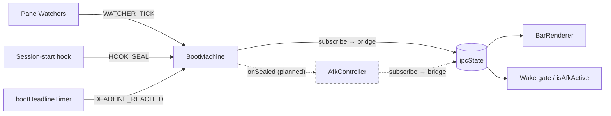

# State Machine Network

The claude-loop runtime is composed of decentralized XState v5 actors,
one per concern. Each actor owns a slice of the shared `ipcState`,
exposes a typed API, and communicates with others by events — no shared
mutable state, no god component.

This doc is the **single source of truth** for the network. Per-machine
internals (states, events, context fields) live in the machine source
file's header — do not duplicate them here. Use this doc for the **map**
of which controller does what and how they wire together.

## Vision

- **One slice per controller** — a single owner of a coherent piece of
  the runtime state (boot phase, AFK mode, pane lifecycle, …). No two
  controllers write to the same ipcState field.
- **Pure machines** — every machine is declarative
  (`setup({...}).createMachine({...})`). No I/O inside. Side-effects are
  driven by external **pumps** (setInterval, event listeners, hooks).
- **Subscriber → ipcState bridge** — each actor has one subscriber that
  mirrors `actor.context` (and state matches) to ipcState fields. That's
  the ONLY path from a controller's context to the shared state.
- **Composition root in `timer.ts`** — actors are instantiated, wired,
  and started in `mainSse`. Pumps + subscribers all live alongside.

## Network overview



Solid = shipped, dashed = planned.

## Controllers

### BootMachine — shipped

| Field | Value |
|---|---|
| **Source** | [`src/claude-loop/boot-machine.ts`](../src/claude-loop/boot-machine.ts) |
| **Role** | Owns the boot phase lifecycle. Single authority for sealing. |
| **Slice owned** | `ipcState.bootDeadlineMs`, `ipcState.bootComplete` |
| **Events in** | `WATCHER_TICK` (pane probes), `DEADLINE_REACHED` (deadline pump), `HOOK_SEAL` (respawn handoff) |
| **States** | `booting` (initial) → `sealed` (terminal) |
| **Pump** | `bootDeadlineTimer` setInterval (1s) in `timer.ts` |
| **Tests** | `boot-machine.test.ts` |

See the source file header for the state diagram and event semantics.

### AfkController — planned

| Field | Value |
|---|---|
| **Source** | `src/claude-loop/afk-machine.ts` (planned) |
| **Role** | F9 toggle cycle + typing-driven arm + timed expiry, with 3s debounce on display. |
| **Slice owned** | `ipcState.afkMode/afkExpiryMs` (committed) + `ipcState.dispAfkMode/dispAfkExpiryMs` (display) |
| **Events in** | `ARM_10M`, `ARM_INF`, `CLEAR`, `EXPIRY_REACHED` |
| **States** | `off`, `pending_10m`, `pending_inf`, `wait_10m`, `wait_inf` |
| **Pump** | `afkExpiryTimer` setInterval (1s) + `after(3000)` internal delays |

Display/committed split is encoded via `pending_*` states with `after(3000)`
delayed transitions to the `wait_*` committed states. The single subscriber
projects two derivations onto ipcState.

### Future controllers (queued)

- **PaneStateController** — pane{Busy,Ready,Compacting,Resuming,Interrupted,Pickers} consolidation.
- **WakeController** — wake gates (in-flight mutex, busy-defer, cooldown, coalesce window).
- **TypingController** — humanTypingAtMs + dispAfk debounce arm.
- **IdleController** — idleSinceMs.

Each will follow the same pattern : pure machine, external pump, subscriber → ipcState bridge.

## Patterns

### Composition root

All actors are instantiated and wired inside `mainSse` in `timer.ts`. Order :

1. Pane watchers fire `change` events (`refreshPaneMarkers`).
2. Controller actors are created with seed input from `readLoopStateInput`.
3. Subscribers are wired BEFORE `actor.start()` so the initial snapshot fires through.
4. External pumps (deadline timer, expiry timer) are armed after start.

### Subscribe → ipcState bridge

The canonical pattern :

```ts
actor.subscribe((snap) => {
    // Mirror context fields the consumers read.
    setIpc<Field>(snap.context.<field>);
    // Trigger side-effects on state-change.
    if (snap.matches("<terminal_state>")) {
        // do once, gated on "is this transition fresh?"
    }
});
```

The subscriber runs synchronously on subscribe (initial snapshot) and on every transition or context change.

### External pump

Machines stay **pure** — no internal timers, no `Date.now()`, no I/O. The
wrapper in `timer.ts` is responsible for :

- Polling `actor.getSnapshot()` and firing synthetic events (e.g.
  `DEADLINE_REACHED` when the wall clock passes `context.deadlineMs`).
- Forwarding external signals (watcher events, hooks, IPC) as
  `actor.send({...})` calls.

This keeps the machine fully testable in isolation (synthetic events, no
wall-clock dependency) while the wrapper integrates with the real runtime.

### Respawn handoff

When the timer re-execs in place (source SHA changed, see `selfReloadIfStale`),
some ipcState is preserved across the spawn (e.g. `bootComplete=true`,
`afkMode/Expiry`). The new actor starts in its initial state but is
immediately synchronised to the live ipcState via an external event
(`HOOK_SEAL` for BootMachine, `ARM_*` for AfkController). The subscriber
detects "already committed" via the ipcState gate and skips fresh-seal
side-effects.

## Adding a new controller

1. Write `<name>-machine.ts` with `setup({...}).createMachine({...})`.
   Pure, no I/O, no `Date.now()`/`Math.random()`. Header comment carries
   the state diagram + event table.
2. Write `<name>-machine.test.ts` covering every transition and guard.
3. In `timer.ts:mainSse` :
   - `const actor = createActor(machine, {input: ...});`
   - `actor.subscribe(snap => bridge snap → ipcState)`
   - `actor.start()`
   - Arm any external pump (e.g. `setInterval` polling `getSnapshot()`).
4. Drop the legacy code path that this controller replaces. Don't leave
   parallel writers — the new controller is the sole owner of its slice.
5. Add a section in this doc (Controllers list above) — single-source the
   role + slice + events. Don't duplicate the state diagram (that lives
   in the source file header).

## Tradeoffs and choices

### Why XState v5 and not a hand-rolled SM ?

- Declarative `setup({...}).createMachine({...})` — the state diagram is
  the source. Less drift between code and intent.
- Built-in `after`, `guard`, parallel states, `assign` — primitives we'd
  otherwise reinvent piecemeal.
- Subscriber/observable API mirrors what we already do with `loopBus` —
  drop-in for the bridge pattern.
- Tests are pure event sequences against `createActor(machine).send(...)`.

### Why one actor per concern, not one big machine ?

- Loose coupling : a controller can be replaced or tested in isolation.
- Single ownership per slice avoids cross-controller race conditions.
- Composition root in `timer.ts` is explicit — no surprising wiring.

### Why XState `after(N)` instead of an external `setTimeout` ?

Internal `after(N)` keeps the timing semantics inside the machine = the
state diagram tells the full story. Equivalent external `setTimeout`
would scatter timing across the wrapper, breaking the "machine = spec"
invariant.

### Why `subscribe` rather than `emit` (XState v5 events) ?

`emit` decouples consumers from context but is an extra event-bus layer.
For ipcState bridging — where the consumer wants the raw context — direct
`subscribe` is simpler. We use `emit` only for cross-controller signaling
where context coupling would be undesirable (e.g. `AfkController` listening
for `BootMachine.onSealed` without reading boot context).

## See also

- [`CLAUDE-LOOP.md`](./CLAUDE-LOOP.md) — claude-loop wrapper overview (uses the network).
- [XState v5 docs](https://stately.ai/docs) — primitives reference.
