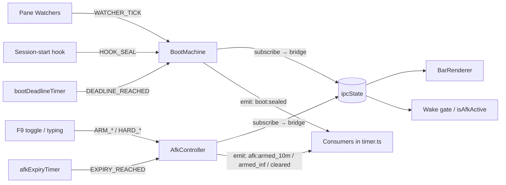

# State Machine Network

The claude-loop runtime is composed of decentralized XState v5 actors,
one per concern. Each actor owns a slice of the shared `ipcState`,
exposes a typed API, and communicates with others by events — no shared
mutable state, no god component.

This doc is the **single source of truth** for the network. Per-machine
internals (states, events, context fields) live in the machine source
file's header — do not duplicate them here. Use this doc for the **map**
of which controller does what and how they wire together.

## Vision

- **One slice per controller** — a single owner of a coherent piece of
  the runtime state (boot phase, AFK mode, pane lifecycle, …). No two
  controllers write to the same ipcState field.
- **Pure machines** — every machine is declarative
  (`setup({...}).createMachine({...})`). No I/O inside. Side-effects are
  driven by external **pumps** (setInterval, event listeners, hooks).
- **Subscriber → ipcState bridge** — each actor has one subscriber that
  mirrors `actor.context` (and state matches) to ipcState fields. That's
  the ONLY path from a controller's context to the shared state.
- **Composition root in `timer.ts`** — actors are instantiated, wired,
  and started in `mainSse`. Pumps + subscribers all live alongside.

## The purity contract — events are the only integration channel

**A machine never manipulates the outside world from inside.** Inside the
declared `actions`, the only allowed operations are :

- `assign({...})` — mutate `context`.
- `emit({type: "<controller>:<event_name>", ...})` — fire a typed locus event.
- Pure helpers (no I/O, no `Date.now()`, no global state reads/writes).

**Forbidden inside machine actions** :

- ❌ `setIpc<Field>(...)` writes — that's the SUBSCRIBER's job, in `timer.ts`.
- ❌ `armAfkViaService` / `tryWake` / any helper that mutates the runtime — that's a CONSUMER's job, via `actor.on(...)`.
- ❌ `log(...)` inside emit actions — log in the consumer (where you have actor identity context), not in the action.
- ❌ `Date.now()` / `Math.random()` / file reads — would break testability and the resume-from-journal property of XState.
- ❌ `actor.send(...)` to itself or another actor — cross-controller signaling goes through `emit` + `actor.on`, not direct sends.

The actor's only outputs to the outside are the **snapshot** (via `subscribe`) and the **emitted events** (via `actor.on`). Outside code never reaches inside.

### Decision rule — when you need to add a behavior

Faced with a new requirement ("when AFK clears AND the user typed in the last second, do X"), apply this decision rule :

| Case | Approach |
|---|---|
| **The behavior is a reaction** to a transition that already exists | Wire a new consumer : `afkActor.on("afk:cleared", cb)` that runs the side-effect. The machine is untouched. |
| **The behavior changes the state structure** (new state, new transition, new guard, new context field) | Revise the SM declaratively : add the state / transition / guard, declare an emit if it's a new locus, write tests. |
| **The behavior is a side-effect inside the machine** | ❌ Wrong shape. Move it OUT to a consumer, or restructure as a state change + emit + consumer. |

The third case is the one to watch for : if you find yourself tempted to call `setIpcXxx` from a machine action, that's the signal that the integration boundary is being violated. Either the consumer needs a new emit to react to, or the state structure needs to change.

### Why this matters

- **Testability** : pure machines are unit-tested by sending events and asserting snapshots/emits, no mocks needed.
- **Replayability** : XState v5 supports persistence + replay of an actor from a journal. Side-effects inside actions would re-execute on replay.
- **Auditability** : grepping `emit({type:` gives the complete public surface of a controller. Side-effects scattered inside actions would hide that surface.
- **Local reasoning** : when changing a consumer, the consumer's logic is fully readable in one place (no fragments inside the machine).

## Network overview



## Controllers

### BootMachine — shipped

| Field | Value |
|---|---|
| **Source** | [`src/claude-loop/boot-machine.ts`](../src/claude-loop/boot-machine.ts) |
| **Role** | Owns the boot phase lifecycle. Single authority for sealing. |
| **Slice owned** | `ipcState.bootDeadlineMs`, `ipcState.bootComplete` |
| **Events in** | `WATCHER_TICK` (pane probes), `DEADLINE_REACHED` (deadline pump), `HOOK_SEAL` (respawn handoff) |
| **Events emitted** | `boot:sealed` { loopStartMs, reason: `"deadline"` \| `"hook"` } |
| **States** | `booting` (initial) → `sealed` (terminal) |
| **Pump** | `bootDeadlineTimer` setInterval (1s) in `timer.ts` |
| **Tests** | `boot-machine.test.ts` |

See the source file header for the state diagram and event semantics.

### AfkController — shipped

| Field | Value |
|---|---|
| **Source** | [`src/claude-loop/afk-machine.ts`](../src/claude-loop/afk-machine.ts) |
| **Role** | F9 toggle cycle + typing-driven arm + timed expiry, with 3s debounce on display. |
| **Slice owned** | `ipcState.afkMode/afkExpiryMs` (committed) + `ipcState.dispAfkMode/dispAfkExpiryMs` (display) |
| **Events in** | `ARM_10M`/`ARM_INF`/`ARM_OFF` (debounced), `HARD_ARM_10M`/`HARD_ARM_INF`/`HARD_CLEAR` (immediate), `EXPIRY_REACHED` |
| **Events emitted** | `afk:armed_10m` { expiryMs, prevMode } / `afk:armed_inf` { prevMode } / `afk:cleared` { prevMode, reason: `"user"` \| `"expiry"` } |
| **States** | `off`, `pending_off`, `pending_10m`, `pending_inf`, `wait_10m`, `wait_inf` |
| **Pump** | `afkExpiryTimer` setInterval (1s) + `after(3000)` internal delays |
| **Tests** | `afk-machine.test.ts` |

Display/committed split is encoded via `pending_*` states with `after(3000)`
delayed transitions to the `wait_*` committed states. The single subscriber
mirrors `context.afkMode/afkExpiryMs` (committed) and projects the leaf
state name to `ipcState.dispAfkMode/dispAfkExpiryMs` (display).

### WakeController — shipped

| Field | Value |
|---|---|
| **Source** | [`src/claude-loop/wake-machine.ts`](../src/claude-loop/wake-machine.ts) |
| **Role** | Owns the wake lifecycle : in-flight mutex (replaces `tryWakeInFlight` Promise) + post-fire cooldown (= coalesce window). External gates (zen, idle-since, wakeAllowed, checkHasWork, drained-state, hasContent) stay in `tryWake` consumer. |
| **Slice owned** | `ipcState.wakeInFlightAtMs`, `lastWakeAtMs` |
| **Events in** | `REQUEST_WAKE` { source, atMs }, `WAKE_DELIVERED` { phrase, headMessageId, deliveredAtMs }, `WAKE_COMPLETED`, `IN_FLIGHT_TTL_EXPIRED` |
| **Events emitted** | `wake:requested` { source, atMs } / `wake:in_flight_started` { atMs } / `wake:delivered` { phrase, headMessageId } / `wake:cleared` { reason: `"completed"` \| `"ttl"` } / `wake:cooldown_expired` |
| **States** | `idle` → `inFlight` → `cooldown` → `idle` (cycle) |
| **Pump** | None — XState `after(inFlightTtl)` + `after(coalesceWindow)` handle the lifecycle. |
| **Tests** | `wake-machine.test.ts` |

The `REQUEST_WAKE` during `inFlight` or `cooldown` is dropped silently — consumers gate with `wakeSvc.isIdle()` before sending. The `wake:delivered` consumer (in `timer.ts:mainSse`) calls `markMessageSeen` on the FIFO-head ack.

### Future controllers (queued)

- **PaneStateController** — pane{Busy,Ready,Compacting,Resuming,Interrupted,Pickers} consolidation.
- **TypingController** — humanTypingAtMs + dispAfk debounce arm.
- **IdleController** — idleSinceMs.

Each will follow the same pattern : pure machine, external pump (if needed), subscriber → ipcState bridge, `<controller>:<event_name>` emits.

## Patterns

### Composition root

All actors are instantiated and wired inside `mainSse` in `timer.ts`. Order :

1. Pane watchers fire `change` events (`refreshPaneMarkers`).
2. Controller actors are created with seed input from `readLoopStateInput`.
3. Subscribers are wired BEFORE `actor.start()` so the initial snapshot fires through.
4. External pumps (deadline timer, expiry timer) are armed after start.

### Subscribe → ipcState bridge

The canonical pattern for mirroring `actor.context` onto the shared
`ipcState` — purely a **state mirror**, no side-effects beyond `setIpc*`
calls :

```ts
actor.subscribe((snap) => {
    // Mirror context fields the consumers read.
    setIpc<Field>(snap.context.<field>);
});
```

The subscriber runs synchronously on subscribe (initial snapshot) and on every transition or context change. Keep it small — reactions to specific transitions live in **locus event consumers** (see below).

### Locus events — `emit` + `actor.on`

Each controller declares its **locus events** (= pivotal transitions the rest of the network cares about) via XState v5 `emit(...)` in transition actions. Consumers subscribe with `actor.on(eventType, cb)` and receive a typed payload.

**Naming convention** : `<controller>:<event_name>` (snake_case after the colon). The prefix identifies the source controller ; consumers can filter by prefix (`event.type.startsWith("afk:")`).

| Controller | Locus events |
|---|---|
| `boot:` | `boot:sealed` |
| `afk:` | `afk:armed_10m`, `afk:armed_inf`, `afk:cleared` |
| `wake:` | `wake:requested`, `wake:in_flight_started`, `wake:delivered`, `wake:cleared`, `wake:cooldown_expired` |
| `pane:` (planned) | `pane:busy_started`, `pane:idle`, `pane:compacting_started`, `pane:compacting_ended` |

**Payload guidelines** — what to put on the event vs what to leave for `subscribe(snap)` or `getSnapshot()` :

- ✅ **Timestamps** (`expiryMs`, `sinceMs`, `elapsedMs`, `loopStartMs`) — useful for decisions and metrics.
- ✅ **Previous state** (`prevMode`) — useful to discriminate transitions sharing the same target (e.g. `wait_10m → off` vs `wait_inf → off`).
- ✅ **Reason discriminator** (`reason: "user" | "expiry"`, `reason: "deadline" | "hook"`) — useful for logs and conditional consumer actions.
- ❌ **Full context snapshot** — defeats the purpose vs `subscribe(snap)`.
- ❌ **ipcState reads** — the consumer can read them itself if needed.

**Typed via `setup.types.emitted`** — the discriminated union forces TypeScript narrowing in consumers :

```ts
// In <controller>-machine.ts
setup({
    types: {
        emitted: {} as
            | { type: "afk:armed_10m"; expiryMs: number; prevMode: AfkMode }
            | { type: "afk:cleared"; prevMode: AfkMode; reason: "user" | "expiry" },
    },
    actions: {
        emitArmed10m: emit(({ context }) => ({
            type: "afk:armed_10m" as const,
            expiryMs: context.afkExpiryMs ?? 0,
            prevMode: context.afkMode,
        })),
    },
})

// In timer.ts (or any consumer)
afkActor.on("afk:armed_10m", (ev) => {
    log(`armed 10m expiry=${new Date(ev.expiryMs).toISOString()} from ${ev.prevMode}`);
});
```

**Emit timing** — place emit actions **first** in the transition's `actions` array so they read `context.<field>` BEFORE the `assign` actions mutate it. Common pattern :

```ts
actions: ["emitX", "commitToTargetState"]  // emit reads OLD context, then assign mutates
```

### External pump

Machines stay **pure** — no internal timers, no `Date.now()`, no I/O. The
wrapper in `timer.ts` is responsible for :

- Polling `actor.getSnapshot()` and firing synthetic events (e.g.
  `DEADLINE_REACHED` when the wall clock passes `context.deadlineMs`).
- Forwarding external signals (watcher events, hooks, IPC) as
  `actor.send({...})` calls.

This keeps the machine fully testable in isolation (synthetic events, no
wall-clock dependency) while the wrapper integrates with the real runtime.

### Respawn handoff

When the timer re-execs in place (source SHA changed, see `selfReloadIfStale`),
some ipcState is preserved across the spawn (e.g. `bootComplete=true`,
`afkMode/Expiry`). The new actor starts in its initial state but is
immediately synchronised to the live ipcState via an external event
(`HOOK_SEAL` for BootMachine, `ARM_*` for AfkController). The subscriber
detects "already committed" via the ipcState gate and skips fresh-seal
side-effects.

## Adding a new controller

1. Write `<name>-machine.ts` with `setup({...}).createMachine({...})`.
   Pure, no I/O, no `Date.now()`/`Math.random()`. Header comment carries
   the state diagram + event table. Declare `setup.types.emitted` with
   the discriminated union of `<name>:<event_name>` locus events + their
   payloads. **Respect the purity contract** (above) — actions only
   `assign` + `emit`, never reach outside.
2. Write `<name>-machine.test.ts` covering every transition, every guard,
   and every emit (`actor.on("<name>:<event_name>", cb)` + assert payload).
3. In `timer.ts:mainSse` :
   - `const actor = createActor(machine, {input: ...});`
   - `actor.subscribe(snap => bridge snap.context → ipcState)` (state mirror only).
   - `actor.on("<name>:<event_name>", ev => ...)` for each locus event reaction.
   - `actor.start()`.
   - Arm any external pump (e.g. `setInterval` polling `getSnapshot()`).
4. Drop the legacy code path that this controller replaces. Don't leave
   parallel writers — the new controller is the sole owner of its slice.
5. Add a section in this doc (Controllers list above) — single-source the
   role + slice + events in + emits. Don't duplicate the state diagram
   (that lives in the source file header).

## Tradeoffs and choices

### Why XState v5 and not a hand-rolled SM ?

- Declarative `setup({...}).createMachine({...})` — the state diagram is
  the source. Less drift between code and intent.
- Built-in `after`, `guard`, parallel states, `assign` — primitives we'd
  otherwise reinvent piecemeal.
- Subscriber/observable API mirrors what we already do with `loopBus` —
  drop-in for the bridge pattern.
- Tests are pure event sequences against `createActor(machine).send(...)`.

### Why one actor per concern, not one big machine ?

- Loose coupling : a controller can be replaced or tested in isolation.
- Single ownership per slice avoids cross-controller race conditions.
- Composition root in `timer.ts` is explicit — no surprising wiring.

### Why XState `after(N)` instead of an external `setTimeout` ?

Internal `after(N)` keeps the timing semantics inside the machine = the
state diagram tells the full story. Equivalent external `setTimeout`
would scatter timing across the wrapper, breaking the "machine = spec"
invariant.

### Why both `subscribe` AND `emit` ?

The two patterns serve different needs and complement each other :

- **`subscribe(snap)`** = continuous **state mirror**. Fires on every snapshot
  change, even mid-transition context updates. Used exclusively to bridge
  `actor.context.<field>` onto `ipcState`.
- **`emit({type: ..., ...})`** + **`actor.on(event, cb)`** = discrete **locus
  events** at specific transitions, with typed payloads. Used for everything
  reactive : log lines, side-effects, cross-controller signaling.

Splitting them keeps each subscriber small and intent-revealing : the
`subscribe` block reads as "what does ipcState mirror", the `actor.on`
blocks read as "what happens on this specific transition".

A controller's transitions can fire BOTH a context update (caught by
`subscribe`) AND an `emit` (caught by `actor.on`) — they're independent
channels.

### Why a typed locus vocabulary (`<controller>:<event_name>`) ?

The prefix scopes ownership : a `wake:requested` event is unambiguously
emitted by the WakeController. Consumers can filter by prefix
(`event.type.startsWith("afk:")`) when they want all events from one source.

The discriminated union via `setup.types.emitted` gives the consumer
TypeScript narrowing for free — `actor.on("afk:armed_10m", ev)` sees
`ev.expiryMs` as `number`, not as `unknown` or `string | undefined`.

## See also

- [`CLAUDE-LOOP.md`](./CLAUDE-LOOP.md) — claude-loop wrapper overview (uses the network).
- [XState v5 docs](https://stately.ai/docs) — primitives reference.
